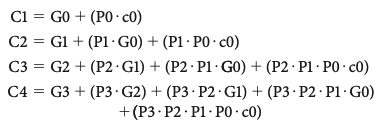

# MIPS 
* RISC

### Data size
* 1 word = 32 bits = 4 bytes
* 1 halfword = 16 bits
* Each memory location is 1 byte

### MIPS - Five stages
* one step per stage
  1. IF: Instruction fetch from memory
  2. ID: Instruction decode & register read
  3. EX: Execute operation or calculate address
  4. MEM: Access memory operand
  5. WB: Write result back to register

# Addressing
* [P119] instructions
* [P105] registers

### MIPS - Registers

### MIPS -  Addressing Mode

* Immediate addressing, where the operand is a constant within the instruction itself
* Register addressing, where the operand is a register
* Base or displacement addressing, where the operand is at the memory location
whose address is the sum of a register and a constant in the instruction
* PC-relative addressing, where the branch address is the sum of the PC and a constant in the instruction
* Pseudodirect addressing, where the jump address is the 26 bits of the instruction concatenated with the upper bits of the PC

### Full Adder
* Input a, b
* $S = (A \oplus B) \oplus C$

### Ripple Carry Adder
* Sum = $A \oplus B \oplus C$
* Carry = $A \cdot B + (A \oplus B) \cdot C$ 

### CLA | Carry-Lookahead Adder
* Full-Adder: Adder that takes in carry-in (3 inputs in all)
* G: Generate, A and B both 1
  * Carry is implied
  * $G_i = A_i \cdot B_i$ (AND gate)
* P: Propagate, Either A or B is 1
  * Carry depends on $C_{in}$
  * $P_i = A_i \oplus B_i$ (XOR gate)
* NOTE: $P_i$, $G_i$ both DO NOT depend on $C$
* Sum: $S_i = P_i \oplus C_i = A_i \oplus B_i \oplus C_i$, 3-input XOR gate
* $C_{i+1} = G_i + P_i \cdot C_i$
* $C_1 = G_0 + P_0 \cdot C_0 = A_0 \cdot B_0 + (A_0 \oplus B_0) \cdot C_0$
* $C_2 = G_1 + P_1 \cdot C_1 = G_1 + P_1 \cdot G_0 + P_1 \cdot P_0 \cdot C_0$ （$C_2$ has delay 6T)
* $C_3 = G_2 + P_2 \cdot C_2 = G_2 + P_2 \cdot G_1 + P_2 \cdot P_1 \cdot G_0 + P_2 \cdot P_1 \cdot P_0 \cdot C_0$
* $G_{\alpha} = G_3 + P_3 \cdot G_2 + P_3 \cdot P_2 \cdot G_1 + P_3 \cdot P_2 \cdot P_1 \cdot G_0$
* $C_1$ is 4T because $P_0$ and $G_0$ are both 2T
* $C_{16}, C_{12}, C_{8}, C_{4}$ all depend on $C_{0}$
* $C_{4} = G_3 + P_3 \cdot G_2 + P_3 \cdot P_2 \cdot G_1 + P_3 \cdot P_2 \cdot P_1 \cdot G_0 + + P_3 \cdot P_2 \cdot P_1 \cdot P_0 \cdot C_0$
* 
* Each 16-bit HCLA has 4 4-bit CLAs inside
* $C_{12} = G_{\gamma} + G_{\beta} \cdot P_{\gamma} + G_{\alpha} \cdot P_{\beta} \cdot P_{\gamma} + C_0 \cdot P_{\alpha} \cdot P_{\beta} \cdot P_{\gamma}$
* 
* Partial CLA: Connect several N-bit Lookahead Adder together
  * Construct a 32-bit partial CLA using four 8-bit
* 

# Pipelining
* Pros:
* Increases the number of simultaneously executing instructions
* lower CPI
* Does NOT reduce time for an individual instruction
* Improves instruction throughput instead of individual instruction execution time / latency
* Cons:
* Designing of the pipelined processor & hazard resolution are complex
* Instruction latency increases in pipelined processors.
* longer pipeline worsens the hazard for branch

### CPI Cycles per instruction
* aka clocks per instruction
* The average number of clock cycles per instruction for a program or program fragment
* e.g. 3 GHz

##### Instruction Count
* Instructions executed for the program
* Dynamic instruction count: how many instructions we actually executed (e.g. all instructions in a for-loop)

##### Clock Cycle Time
* Seconds per clock cycle

### CPU Time [P67]
CPU Time = Instruction Count(i) $\times$ CPI(c/i) / Clock Rate(c/s)

= CPU Clock Cycles(c) / Clock Rate(c/s)

= CPU Clock Cycles(c) $\times$ Clock Cycle Time(s/c)

ET = Instruction count (i) * CPI (c/i) * Cycle time (s/c)

Why single-cycle is a bad idea:
Although the CPI is 1, the overall performance of a single-cycle implementation is likely to be poor, since the clock cycle is too long.

### Addressing
* Register Addressing
* Immediate Addressing 
* PC-Relative Addressing
* Base Addressing
* Pseudo-Direct Addressing

# Datapath
* Consists of 2 types of logic elements

### Single-cycle datapath
* Recall: ET = IC * CPI * CT 
* CPI = 1 (Every instruction is done in 1 cycle, no matter lw/sw...)
* Clock cycle is slow
* Does not influence instruction count

### Combinational
* Elements that operate on data values
* Outputs only depend on current inputs
* e.g. ALU

### Sequential
* Logic components that contain state
* Outputs depend on both inputs and the contents of the internal states

### State elemetns
* Elements that contain states. They have internal storage
* e.g. the instruction and data memories, the registers

#### Edge-triggered clocking
* An edge-triggered clocking methodology means that any values stored in a sequential logic element are updated only on a clock edge

# Instructions
## R-format Instruction
* aka Arithmetic-logical instruction
* read TWO registers, perform an ALU operation on the contents of the registers, and write the result to ONE register
* OP RS RT RD
* Reads from RS RT, writes to RD
* e.g. add, sub, AND, OR, slt
* Need to check the Opcode first to determine whether it is an R-type
* Then we look at the function to see what functions we need to perform
* **eNOTE**: All r-type have the same OpCode. They differ in the function field
  * Function is input; We use the function field to distinguish between instructions

## I-format Instruction
* OP RS RT IMM 
* Reads from RS, writes to RT
* e.g. lw, sw, beq, bne
* lw: R[rt] <= M[R[rs]+SE(I)]
  * format: lw tgt src
  * `lw   $t0, 0($t1)`
* sw: R[rt] => M[R[rs]+SE(I)]
* We need two operations:
  * add for **lw/sw**
  * sub for **beq**

* Shift left
  * `sll  $t1, $s3, 2`
* add src tgt amount
  * `add  $s3, $s3, 1 # adds values in 2 regs`
  * `addi $t1, $t1, $s6 # adds an immediate value to the reg`

### ALU

* Zero output: indicates two operands are equal

* MemtoReg field is irrelevant when the RegWrite signal is 0: since the register is not being written, the value of the data on the register data write port is not used

### Register file
* Inputs: 2 5-bits addresses
* Outputs: 2 32-bits words 
* Register file is a collection of registers in which any register can be read or written by specifying the number of the register in the file
* Stores the 32 general-purpose registers
* Reducing register field will cause more **register spilling**: the compiler moves some live variables to the memory from the registers when there are not enough registers to assign all the live variables

## Control signals [P264]

* Most control signals are 1-bit, except ALUOp (2-bits), which goes into ALU control unit
* ALUOP

  * 00: lw, sw, where we perform addition
  * 01: beq, where we perform subtraction
  * 10: R-type: add, sub, and, or, slt
  * ALUOP is Never 11
* RegDst: Determines which register is the destination (which one we write to)
  * 0: rt(20:16), 1:rd(15:11)
* RegWrite: 
  * 1: write back to register, e.g. lw, R-format
  * 0: not writing back, e.g. sw, beq
* ALUSrc
  * 1: second operand comes from sign-extended 16-bits of instruction
  * 0: second operand comes from the register files
* MemToReg: Do we bypass the memory's output to write to the register file
  * ONLY meaningful when MemWrite=1
* MemRead: Indicates whether to read from memory (only lw)
* MemWrite: whether to write to memory (using address from ALU) (only sw)
* PCSrc: controls MUX that updatest PC
  * 0: PC = PC+4
  * 1: PC points to branch target

### Control Signals | Don't cares
* 
* lw: RegDst, 
* sw: RegDst, MemToReg
* Branch: RegDst, MemToReg
* 
#### Jump
* Replaces the lower 28-bits of the PC with the lower 26 bits of the instruction shifted left by 2 bits
* Leverages the "zero" output in ALU

#### Branch
* In MIPS, branches are delayed
* The instruction immediately following the branch is always executed, whether the path is taken

#### Multiplication
* Goes from LSB to MSB for the multiplier

#### SLT
* Set R[rd] to 1 or 0 (31 bits followed by a 1 or 0); if a condition is true, then sets 1
* Usually used together with beq/bne for branching
* slt rd, rs, rt
* if (rs < rt) rd = 1; else rd = 0;
* slti rt, rs, constant 
* if (rs < constant) rt = 1; else rt = 0; 'i' means immediate
* slt only results in change of comparison value; must use in combination with beq, bne 

## Conditional operations
* beq rs, rt, L1
  * if (rs == rt) branch to instruction labeled L1 (MUX 1)
    * i.e. PC = PC+4+SE[I] (sign-extended & shifted immediate)
    * else just PC+4 (MUX 0)
* bne rs, rt, L1
  * if (rs != rt) branch to instruction labeled L1
* beq / bne deals with word-level addressing, whereas load / store deals with byte-level addressing,
* j L1
  * unconditional jump to instruction labeled L1

### Jump
* Jump uses word address
* Update PC with concatenation of 
  * Top 4 bits of old PC
  * 26-bit jump address
  * 00
* If we go beyond the address restricted by the upper 4 bits, we need to Jump, LUI, ORI
* Pseudodirect addressing: the jump address is the 26 bits of the instruction concatenated with the upper bits of the PC
* `jal`: jump and link
  * Saves the return address (pc+4) in `$ra` for procedure return

### Latency vs Throughput
* Throughput is a measure of bandwidth (how many programs compiled in that amount time)

# Finals

* ISA - allocation 
  * tradeoff in ISA space: more bits in imm than regs
  * **[IMPORTANT]** impacts on CPI, IC, CT (e.g. if we give more bits to imm and branch further)
* Performance - ET = IC * TCPI * CT
* ALU (no timing questions)
* RC vs CSA vs CLA (tradeoffs, NO timing analysis)
  * e.g. which of the following is the tradeoff of RC and CSA is
    * Area, timing, ... (Multiple-choice)
* Single-cycle datapath
* Pipelining
  * 5-stage pipeline - data hazard
    * Hardware: Stalls, forwarding
    * Software: NOP, reorganize code
    * Hazard detection logic in ID/EX latch(how to make it): (when to send control logic bits or all zeros); how to make stall logic in IF/ID
  * control hazard
    * 1-bit/2-bit predictor
* **[IMPORTANT]** Pipeline Extension (and how that affects hazards, timing diagram, fix design in its forwarding logics) 
  * Super-scalar/Super pipelining
    * **[IMPORTANT]** VLIW Scheduling
      * (Optional) dynamic out-of-order execution vs VLIW - tradeoffs
    * Loop unrolling -> get more parallelism
  * staggered alu

* Why we need the pink line to latch 
  * If instruction D at EX1 needs data from instruction A at WB, A can forward lower-bit data to D at EX1. Once A leaves the pipeline, the value is gone, and cannot be used by D in EX2

* Cache
  * **[IMPORTANT]** Cache miss / hit behavior
  * DM, FA, SA
  * Total size = number of indices * associativity * block size
  * Total number of cache blocks = number of indices * associativity
  * number of index bits = $\log$(number of indices)
  * number of sets = number of entries represented by the index bits / associativity
    * For fully associative cache, tag is the word address
  * e.g. 4KB 2-way set associative with 8 byte block size
    * $2^{12} = 2^8 * 2 * 2^3$, 8 index bits
  * NOTE: Cache is in blocks; TLB is in pages.
  * Cache offset uses block size; NOT necessary the same as Page Offset

* Direct-mapped
  * Pros: Simple, low access time (finding a block does NOT depend on a comparison)
  * 
* Increase degree of associativity
  * Pros: decreases the miss rate, since we reduce misses that compete for the same location
  * Cons: increase cost, slower access time
* Set-associative block lookup

* TLB [P441]
  * e.g. 1KB 8-way set associative with 8 byte block size
    * $2^{10} = 2^6 * 2 * 2^3$, 6 index bits
  * Index: $\log_2$(number of entries in TLB) (OR number of indices)
  * Offset = $\log_2$(page size)
  * Fully associative TLB: Lower miss rate
  * e.g. Page size of $2^{15}$ bytes, 48-bits, VA, 8-way set associative TLB holds $2^{6}$ translation
    * $\frac{2^6}{2^3} = 2^3$, thus 3 index bits
    * Tag: 30 bits, Index: 3 bits, Offset: 15 bits

| Tag(TLB)  | Index(TLB) | Offset(TLB)     |
|-----------|------------|-----------------|
| ...010111 | 100        | 011000001100000 |
| 30        | 3          | 15              |
* If index and tag are the same in subsequent access, then it is a hit
    * Tag and Index form the vaddr
    * Page Offset is Index + Offset bits
    * Page Number is Tag bits, which gets translated into Frame Number in PA
* Page Table
  * Size = number of VA's * (number of bits for metadata + number of bits for PA)
  * e.g. 60-bit vaddr, 32-bit paddr, $2^{10} Bytes$ pages
    * Page Table Size = $2^{50} * (2 + 22) bits$

* **[Multi-C]** [VIPT](https://en.wikipedia.org/wiki/CPU_cache) Cache (Virtually Indexed, Physically Tagged) (Multiple Choice)
* VIPT, PIPT, VIVT are ways that cache interacts with virtual and physical addressing
* PIPT: sequential access to TLB & cache; usually used in slow cache
  * Pros: Simple, avoids aliasing
  * Cons: longer delay to access cache, since the physical address must be looked up (TLB or even main memory upon a TLB miss) before the address is looked up in main memory

* VIVT: Uses VA for both index and the tag
  * Pros: Faster lookup
  * Cons: aliasing, several different vaddr refer to the same paddr; for 2 concurrent applications with same vaddr but different address spaces, VIVT does NOT distinguish between the two
  * Tag comes from Frame Number, Index comes from Index + Offset bits
  

* [VIPT](https://en.wikipedia.org/wiki/CPU_cache): uses vaddr for index and paddr for tag
  * Pros: the lookup can start in parallel with the address translation, thus lower latency compared with PIPT;
  * The correct size for the index depends on the page size: translations between virtual and physical address is made at page level
    * the index is chosen so that it always refers to the offset of the cache line inside the page

* e.g. Cache Size $2^{14}$ Bytes, block size $2^5$, 4-way set associative, thus for index: $\frac{2^{14}}{2^5 * 2^2} = 2^7$
  * Tag: 20 bits, Index: 7 bits, Offset: 5 bits
  * if indices are different, then it is a miss
  * All bits above the 5 Offset bits are a cache block address

| Tag(Cache)      | Index(Cache) | Offset(Cache) |
|-----------------|--------------|---------------|
| ...010111100011 | 0000011      | 00000         |
| 20              | 7            | 5             |

* VM
* Size of page determines number of offsets
  * 16KB page means 14-bit offsets
  * $\frac{2^{14}}{2^2 * 2^5} = 2^7$ - 7 bits for indices

* Page faults
* **[IMPORTANT]** TCPI = BCPI + MCPI

* Branch resolved in MEM | EX | ID

* Pipeline 4-bit RC ALU

# Final - NOT covered
* NO alu timing

# Pipelining (contd.)

## Dependency
* True data dependency: RAW (Read after Write)
* False data dependency: WAW, WAR
* Scheduing dependency: Problematic if some instructions are moved ahead (Anti-dependency), and we use the new values
  * slt ... t0
  * add t0, ...
* Solutions
  * Software: NOP, Instruction Reordering
  * Hardware: Pipeline stalls, forwarding (larger CPI, smaller IC compared with Software approach)
* anti-dependency: an ordering forced purely by the reuse of a name
  * **WAW**, **WAR**
  * e.g. in loop unrolling, using `t0` repetitively
* true dependence: real data dependence
  * **RAW**

### Hazard [P278]
* Structural Hazard
  * Using the same hardware at the same time (required resource is busy)
    * e.g. Multiple instructions flowing through the pipeline and both using a single data port to memory
* Data Hazard [P311]
  * Dependence across instructions. An instruction must wait for the previous one to complete
* Control Hazard
  * Arises from the need to make a decision based on the results of one instruction while others are executing (e.g. branch)

* 10 means choosing value from EX/MEM
* 01 means choosing value from MEM/WB

### Pipeline stall (HW)
* Holds information produced in previous cycle
* Bubbles: current instruction stays in the current stage, waiting for the preceding instruction to finish
  * Ensure that next instruction does NOT come into IF stage
  * Cons: increases CPI (1 + pipeline stall cycles per ins); might increase CT
  * e.g. 30% branch, stalling 3 cycles per branch, then CPI = 1 + 0.3 * 3
* stopping instructions
* Detect the hazard, Stall the pipeline
* prevent the IF and ID stages from making progress
  * the ID stage because we can’t go on until the dependent
instruction completes correctly
  * the IF stage because instructions can accumulate and we may lose instructions.
* For lw, the register value is only avaiable after the M stage
  * lw  t0, 0(t0)
  * beq t0 0, TAG
  * *ID* stage of **beq** follows *M* stage of **lw**

### Forwarding / Bypassing (HW)
* Next instruction uses results from previous instruction as soon as it is available, rather than waiting for WB
  * For R-type: stores results in EX/MEM latch after the result becomes available in EX
  * Cons: might increase CT (additional forwarding unit must be on the critical path)

### NOP (SW)
* Usually done by **Shifting by 0**
* ET = IC * CPI * CT 
  * CT decreases or stay the same
  * (IC goes up due to inserted NOPs)
  * CPI probably also goes up since the cache holds more instructions, but take it for 1.0 now
* Cons: must recompile every time we change to a new architecture

### Instruction reordering (SW)
* Pros: CPI and IC both NOT changed
* Cons: 
  * Longer compile time
  * Strict rules: must have NO dependency or anti-dependency
  * Code might not be portable among different machines implementing the same ISA. Reorderig exposes more details about architectures to the compiler
  * Hard to move around branches

### Branch prediction
* Branch Target Buffer
  * Store the target address from previous instance and access it with the PC
* Dynamic branch prediction
  * CPI increases, CT increases or stay the same, IC stays the same
  * Prediction of branches at runtime using runtime information
  * look up the address of the instruction to see if a branch was taken the last time this instruction was executed, and, if so, to begin fetching new instructions from the same place as the last time
  * Uses branch prediction buffer or branch history table

### Branch Delay Slot (SW)
* Reorder instructions to put independent instructions in delay slots; if no independent instructions, put noOps in the slots
* Pros: No flushing
* Cons: Might need to recompile if we switch to a new architecture (with different length of pipeline)
  * Hard to find independent instruction to place after the branch

### Super-pipelining
* Objective: reduce ET = IC * CPI * CT by cutting CT
* Pros: Reduces CT
* Cons: Longer stalls for load-use hazard
  * longer stall for load-use hazard
  * flush more instructions for branch prediction

### Superscalar (Dynamic Multiple-Issue Processors) [P339]
* Execute multiple instructions in the same cycle
* Issue the same number of instructions on each cycle
* Objective: reduces ET by cutting CT
* 
* 

### Branch resolved in EX
* We get the correct result of branching at the end of **EX** of **beq** (a.k.a the start of **MEM** stage)
* So **ID** of the next instruction can execute when **beq** is at MEM
* Assume branch resolved in **EX**, the number of stages to flush upon wrong branch prediction depends on number of stages before **EX**, which is 2
  * Means we have 2 delay slots

### Number of instructions
* Cycles is the sum of: 
  * number of instructions
  * time to fill the pipeline (4)
  * Stalls due to data dependency (lw)
    * IF (ID) ID EX M WB
    * **2** for no forwarding, **1** for with forwarding
  * Branch penalty (branch following R-type)
    * (IF) IF ID EX M WB
    * **2** for no forwarding, **1** for with forwarding

### VLIW [P335]
A style of instruction set architecture that launches many operations that are defined to be independent in a single wide instruction, typically with many separate opcode fields.
* Static multiple issue

### Loop unrolling
* Multiple copies of the loop body are made
* More ILP available by overlapping instructions from different iterations.
* Pros: reduces control hazard
* Cons:
  * Increases code size
  * Using more temporary registers

### Dynamic Pipeline Scheduling
* chooses which instructions to execute next, possibly reordering them to avoid stalls.

# Cache
If the tag and upper 20 bits of the address are equal and the valid bit is on, then the request hits in the cache, and the word is supplied to the processor. Otherwise, a miss occurs.

* Number of blocks in cache = Number of indices * associativity
  * Thus, if total number of blocks is 4, the greatest associativity is 4
* Use **tag** field to find the correct entry in cache
* Use **offset** field to get the correct bits from **data** in the entry
  * Assume 64-byte blocks. **Offset** field needs 6 bits
* Problems of Cache:
* Cache Consistency: when changing content of cache, how to propagate the change to lower hierarchies (e.g. memory)
  * e.g. When we modify data in L1, when do we  propagate these changes to L2?
  * How changes made solely to one cache trickles down to Memory
* Cache Coherence: For two threads running on different cores, how can the Writes from thread A (on Core 0) be immediately available for thread B (Core 1)
  * How changes made to one cache trickle down and trickle up to other cores (across different cores)
* Cache size = block size * number of blocks
* Set number = number of blocks / associativity
* Fully-associative cache: Number of indices = 1

### Cache Miss [P459]

* **Compulsory (cold) miss**: happens even if cache is infinite
  * Solution: bring in more adjacent blocks when fetching from lower-level (stream buffer)
* **Capacity miss**: when the cache is too small to hold all concurrently used data
  * We can check whether it is a capacity miss by making the cache a fully-associative cache (of the same size) and see if it still misses. It is capacity miss if we still miss. Simply use a sliding window of that cache size on the past few entries we visited
  * e.g. For a 2-way associative cache of size 4, if for one entry 0110, there are 3 different accesses in-between, then this should be a conflict miss
  * Solution: Increases cache size (Cons: increases cache access time) (Just increasing associativity does NOT help)
* **Conflict (Collision) miss**: when several addresses map to the same set and evict blocks that are still needed
  * Due to insufficient set-associativity; happended in direct mapped or set-associative cache
  * Solution: Adjust associativity
* TLB possible scenarios [P443]

* Directed mapped cache have higher number of conflict misses, but are fast and easy to implement

### Write-back [P394]
* WB / WT deals with stores that hit (the written blocks are already in cache)
* Write the data into only the blocks in data cache (then set dirty bit to 1) without changing main memory
* Write to the backing store is postponed until the modified content is about to be replaced by another cache block
* After the write into the cache, memory would have a different value from that in the cache
* The cache and memory are inconsistent when memory has a different value from the value in the cache
  * e.g. if **L2** is write-back and **L1** is write-through, in a **sw** of A (which follows a **lw** of A), we only writes to A in **L1** and **L2** instead of the memory
* We assume we do NOT stall the pipeline for a write-through

* Pros: Faster when a memory location is written to after short period; leverages spatial & temporal locality
* Cons: longer miss penalty
  * More complex to implement, since it needs to track which of its locations have been written over, and mark them as dirty for later writing to the backing store

### Write-through [P393]
* Writes always update both the cache and the next lower level of the memory hierarchy

* Pros: Uniform miss latency
* Cons: Consider applications that frequently write and re-read the same data

### [Write-allocate](https://en.wikipedia.org/wiki/Cache_(computing))
* Both deal with stores that incur **write miss**: Write to address not already contained in the cache
* Difference: whether to bring in the data that miss from the store into the cache or not
* Data at the missed-write location is loaded to cache, followed by a write-hit operation
* In this approach, write misses are similar to read misses
* leverages locality in stores and loads (if data we write to is needed again soon)
* Usually paired with **write-back**, hoping that subsequent writes and reads of the same location (which is now cached)

* e.g. if **L2** is write-around and **L1** is write-allocate, in a **sw** of A (with NO preceding **lw** of A), we only writes to A in **L1** and **L2** instead of the memory

### Write-around (Write-no-allocate)
* Write directly to Memory without writing to the Cache
* For a write around policy, we write directly to memory without writing to the cache
* data at the missed-write location is not loaded to cache, and is written directly to the backing store
* Data is loaded into the cache on read misses only
* Usually paired with **write-through**, then subsequent writes have no advantage, since they still need to be written directly to the backing store
* Pros: Will not flood the cache with data that may not be re-read subsequently; avoid bringing blocks with no locality 
* Cons: Reading recently written data will result in a cache miss (high latency)

### AMAT | Average memory access time
* hit time + miss% * miss penalty

### TCPI
* TCPI = BCPI + MCPI
* BCPI = Peak **CPI** + Data-hazard **CPI** + Control-hazard **CPI** 
  * Data hazard: (load)% sum of (load with dependent instruction)% * Cycles for stall
  * Control hazard: miss prediction rate * branch% * branch penalty
* MCPI = Instruction cache miss **CPI** + Data cache miss **CPI** (lw/sw)
  * IM: amortized I-cache access cycles
  * DM: amortized D-cache access cycles * (load & store)%

### Snooping Cache
* There is a common bus to communicate the updates to private caches
* When a modification is made to a cache block, the modifying core will send a modified message to the common bus
* All cores listen to the snoop bus, so that when core A write to a particular block in L1, core B invalidates its own version of that block in L1
* We usually choose write-through for snoop bus

### Page
* To access memory
  * vaddr->paddr
  * Use paddr to access memory
* Page offset depends on page size
  * e.g. 16 KBytes page needs page offset of 14 
* Physical page address = length of PA - Page offset
* Virtual page address = length of VA - Page offset