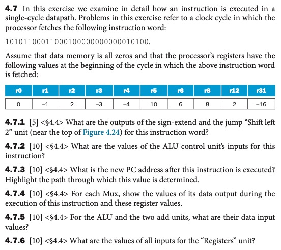

# Homework 4
Name: Yiqiao Jin  
UID: 305107551



## 4.7

The instruction should be partitioned as

101011 00011 00010 00000 00000010100

This is a store word(sw) instruction.

#### 4.7.1


For Sign-extend, the lowest 16-bits are sign-extended to 32 bits. So the instruction becomes:

00000000 00000000 0000000 000010100

For Jump’s shift-left-2, the lower 26-bits are shifted left by 2, while the upper 6 bits remain unchanged. So the lowest 28-bits of the instruction becomes:

0001 10001000 00000000 01010000

#### 4.7.2
The OpCode is 101011. The ALUOp is 00 for add

The instruction: 010100

#### 4.7.3
Path: PC -> ADD gate for PC+4 -> Input 0 of the branch MUX -> Input 0 of the jump MUX -> PC

New PC is PC+4 since Branch and Jump signals are both 0

#### 4.7.4
Since sw is an I-type instruction:

MUX (branch) and MUX (jump): Both output PC+4 since both of their control signals are 0

MUX (RegDst): Output is 2 or 0. For sw instruction, RegDst is "don't care." So it may output either of its inputs (r2 or r0) depending on the state of RegDst.

MUX (ALUSrc): Output is 20. For sw, the output of this MUX, or the input of the ALU, will be the sign-extended immediate (0...010100)

MUX (MemtoReg): Output is the memory read data or 17 (the ALU result). Since MemtoReg is a don't care for lw.

Note that 17 = R[rs] + SE(I) = -3 + 20

#### 4.7.5
Read data 1 reads from register rs. This is 00011 or r3, which has value -3. Read data 2 outputs the sign-extended immediate 20. Thus the data inputs are -3 and 20.


The PC adder's inputs are the current PC and 4. It outputs PC+4

The Branch adder's inputs are PC+4 and 80 (80 is the sign-extended immediate 10100 left-shifted by 2)

#### 4.7.6

Read Register 1: 3 

Read Register 2: 2 

Write Register: 2 or 0 (RegDst is don't care for I-type)

Write Data: Memory Read Data signal or 17 (not depending on MemToReg)

RegWrite: 0


## 1.BLTC

```
if (R[rs] < R[rt])
  PC = PC + 4 + SE(I)
else 
  PC = PC + 4
```
We can let the ALU execute a subtraction instruction between R[rs] and R[rt]. The output will be negative (sign-bit of the result is 1) if R[rs] < R[rt]. Then we AND this sign-bit of the ALU result with a new ***blt*** control signal, which will be 1 if the current instruction is a blt. 

The other solution is to use the ***blt*** control signal ANDed with the MSB of the ALU output as the control signal for a new MUX

#### Inputs: A new Opcode for I-type instruction

#### Outputs

| Signal    | BLT |
|-----------|-----|
| RegDst    | X   |
| ALUSrc    | 0   |
| MemToReg  | X   |
| RegWrite  | 0   |
| MemToRead | 0   |
| MemWrite  | 0   |
| Branch    | 1   |
| ALUOp1    | 0   |
| ALUOp2    | 1   |
| BLTC      | 1   |

## 2.jal
```
R[$r31] = PC+4
PC = [31..28](PC+4) | [27..0] (I<<2)
```
jal is the only instruction that can access the program counter, which writes PC+4 to r31 

#### Inputs: A new Opcode for J-type instruction

#### Outputs

| Signal    | JAL |
|-----------|-----|
| RegDst    | X   |
| ALUSrc    | X   |
| MemToReg  | X   |
| RegWrite  | 1   |
| MemToRead | 0   |
| MemWrite  | 0   |
| Branch    | X   |
| ALUOp1    | X   |
| ALUOp2    | X   |
| JALC      | 1   |

Note that the branch result is overwritten by the new MUX

## 3.jr
```
PC = R[rs]
```

#### Inputs: A new Opcode for J-type instruction

#### Outputs
| Signal    | JR  |
|-----------|-----|
| RegDst    | X   |
| ALUSrc    | X   |
| MemToReg  | X   |
| RegWrite  | 0   |
| MemToRead | 0   |
| MemWrite  | 0   |
| Branch    | X   |
| ALUOp1    | X   |
| ALUOp2    | X   |
| JRC       | 1   |


