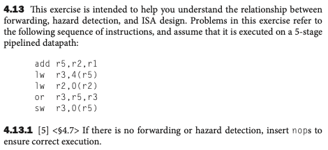
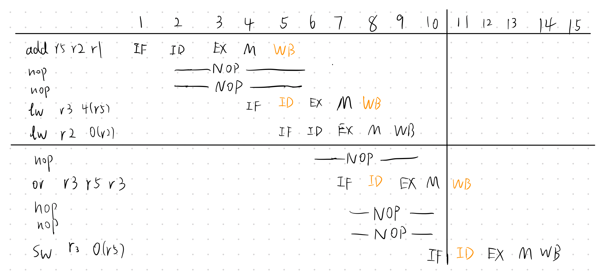
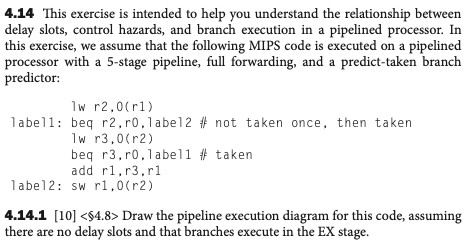
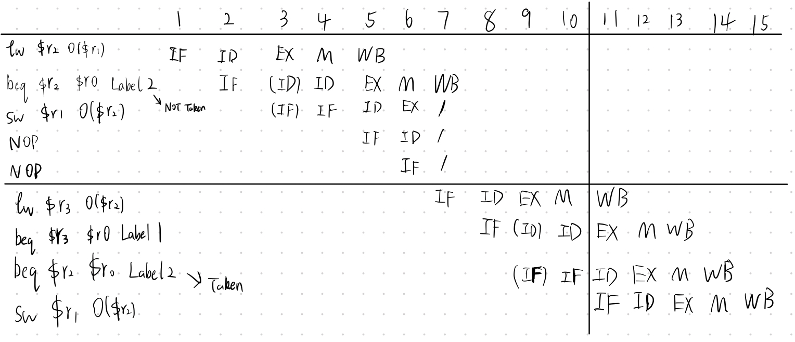
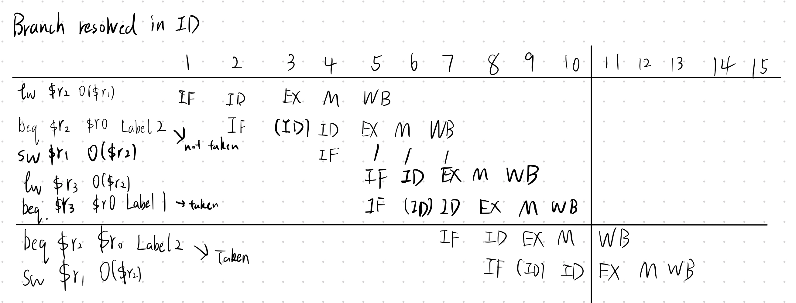
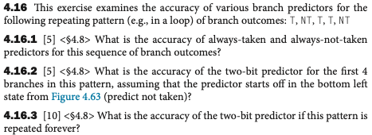

# Homework 5
Name: Yiqiao Jin  
UID: 305107551

## 4.13.1

If the current instruction uses the output of the previous instruction, then there must be at least 2 instructions in-between. The ID stage of current instruction must be in the same cycle or previous cycles of the previous instruction. This dependency relation exists between:
* the first **add** and the first **lw**
* the first **lw** and the **or**
* the **or** and the **sw**

The first and third cases both need two **nop**'s. The second one requires 1 **nop** since there is a second **lw** in-between which does not have any dependency on previous instructions.

#### With forwarding logic
The only case we need to care about is when an instruction uses a source register that was written by a preceding **lw** instruction (MEM stage if one instruction to its 1st next instruction). Both of the **lw** instructions here do NOT have such dependency. So the instructions will take 9 cycles: (5-1) + 5 = 9

## 4.14.1

show the pipeline diagram for:

a) full forwarding, branches resolved in EX

b) full forwarding, branches resolved in ID

#### Pipeline execution diagram
Branch resolved in EX: 15 cycles

Branch resolved in ID: 13 cycles

## 4.16.1-4.16.3

### 4.16.1
Accuracy:   
Always taken: 3/5 or 60%; Always not taken: 2/5 or 40%

### 4.16.2
Before each prediction is made, the state we are in are: 00, 01, 00, 01. 

Note that 00 is "Strong not taken" and 01 is "Weak not taken"

Our prediction will be NT, NT, NT, NT

This yields an accuracy of 25%

### 4.16.3
Our states: 00, 01, 00, 01, 10 | 01, 10, 01, 10, 11 | 10, 11, 10, 11, 11 ...

Actual Sequence: T, NT, T, T, NT | T, NT, T, T, NT | T, NT, T, T, NT ...

Our predictions: NT, NT, NT, NT, T | NT, T, NT, T, T | T, T, T, T, T

Correctness: N, Y, N, N, N  | N, N, N, Y, N | Y, N, Y, Y, N

At the end of the loop, we are always in "Strong taken" state or State 11. The first two iterations have accuracy of 20%, and the accuracy will stay at 60% for each followup iteration.

Thus, given $i$ iterations the overall accuracy is $(0.2 \times 2 + 0.6 \times (i - 2))/i$ 