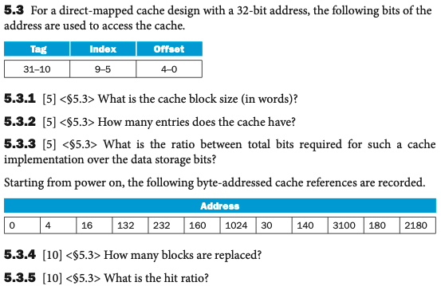
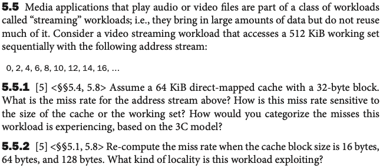
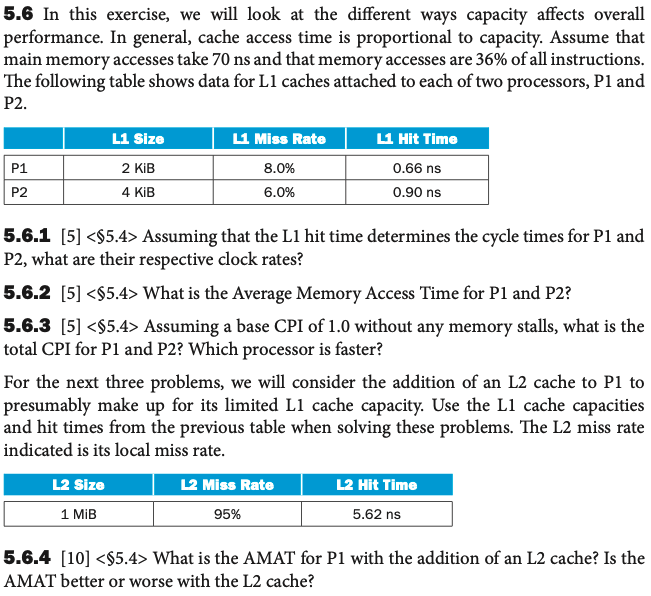

# Homework 7
Name: Yiqiao Jin  
UID: 305107551

## 5.3

#### 5.3.1
5 offset bits indicates a block size of $2^5$ bytes, or 32 bytes。This means 8 words per block (1 word is 4 bytes).

#### 5.3.2
5 index bits means $2^5$ sets, or 32 sets. We know that there is 1 entry per set for direct mapped cache, so there are 32 entries in total. 

#### 5.3.4

| Address | Tag Index Offset | H/M |
|---------|------------------|-----|
| 0       | 00 00000 00000   | M   |
| 4       | 00 00000 00100   | H   |
| 16      | 00 00000 10000   | H   |
| 132     | 00 00100 00100   | M   |
| 232     | 00 00111 01000   | M   |
| 160     | 00 00101 00000   | M   |
| 1024    | 01 00000 00000   | M   |
| 30      | 00 00000 11110   | M   |
| 140     | 00 00100 01100   | H   |
| 3100    | 11 00000 11100   | M   |
| 180     | 00 00101 10100   | H   |
| 2180    | 10 00100 00100   | M   |

For addresses 1024, 30, 3100, and 2180 the blocks are replaced. So 4 blocks are replaced in total.

#### 5.3.5
There are 4 hits for 12 instructions. So hit rate is $\frac{4}{12}$, or $\frac{1}{3}$.

#### 5.5.1
For a 32-byte block, we draw in 32 contiguous addresses upon each cache miss.

For this access pattern, there will be one miss for every 16 accesses, giving a miss rate of $\frac{1}{16}$. Each miss is a   compulsory miss, meaning that the block is NOT seen by the cache in previous accesses of data memory.

#### 5.5.2
For 16-byte blocks, we draw in 16 contiguous addresses upon each cache miss. A single block will contain 8 accesses. There is 1 cold miss for every 8 accesses, giving a miss rate of $\frac{1}{8}$

For 64-byte blocks, there is 1 cold miss for every 32 accesses, giving a miss rate of $\frac{1}{32}$

For 128-byte blocks, there is 1 cold miss for every 64 accesses, giving a miss rate of $\frac{1}{64}$

In this case, we exploit spatial locality - if we use an entry, its adjacent entries are more like to be used in the near future.

#### 5.6.2
P1: AMAT = hit time + miss rate * penalty = 0.66 + 0.08 * 70 = 6.26

P2: AMAT = 0.90 + 0.06 * 70 = 5.10

#### 5.6.4
P1: New AMAT = 0.66 + 0.08 * (5.62 + 0.95 * 70) = 6.43

The new AMAT is worse due to the high miss rate of L2 Cache.